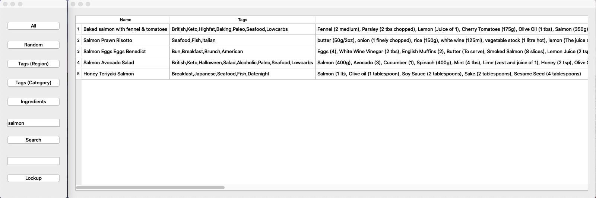
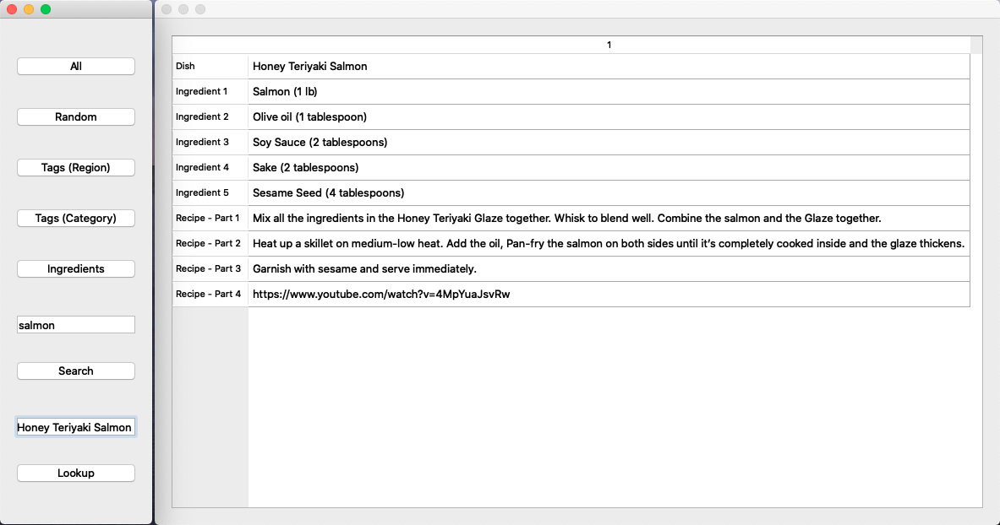
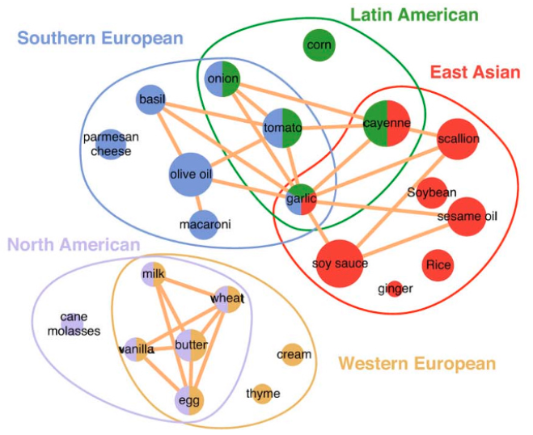

# pycuisine
###### by faydyn
___
### Overview
##### Shows Recipes in general or for specific searchterms:

##### Looks up individual dishes:

    
    Searchterms in lowercase (e.g. fish,apple,ginger).
    Exclusionterms in UPPERCASE (e.g MEAT,CHICKEN,PORK,BEEF).
    
    Search in 1. Textbox.
    Lookup in 2. Textbox.
   
___
### Functionality
+ [Database](https://www.themealdb.com)

+ [Parser via DB-API](../mealdb_api/prepDB.py)

+ [GUI with __PyQt__](../src/main/python/main.py)

+ [__fbs__ for standalone programs](https://github.com/mherrmann/fbs-tutorial)

___
### WIP
+ Save Favorites

+ Click on Dishname and directly open Dish (w/o Lookup)

+ Google Search, if nothing found

+ Sophisticated DB (incl. Search)
    + parse more Data (make Webscraper)
    + theoretical background: 
 

